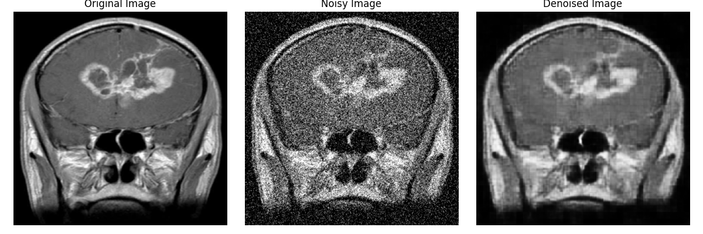
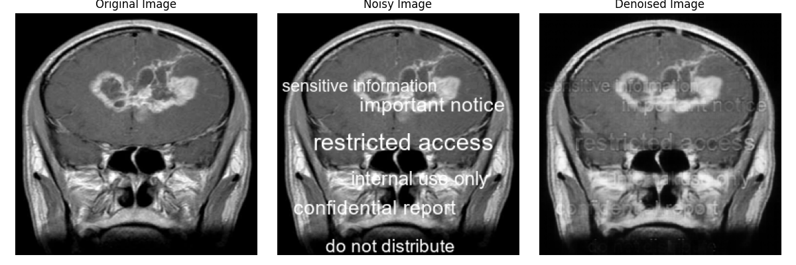

# Project: Image Denoising and Inpainting

This project focuses on two key image processing tasks: **Denoising** and **Inpainting**. The aim is to enhance image quality by removing noise and reconstructing corrupted (by text) parts of images.

🔬 **Based on the paper**:  
[Xie, J., Xu, L., & Chen, E. (2012). *Image Denoising and Inpainting with Deep Neural Networks*. Advances in Neural Information Processing Systems (NeurIPS 2012)](https://papers.nips.cc/paper_files/paper/2012/file/6cdd60ea0045eb7a6ec44c54d29ed402-Paper.pdf)

---

## 📁 Directory Structure

### 1. **Denoising**
This directory contains the implementation for removing noise from images. It includes:
- `model.py`: The model used for denoising.
- `utils.py`: Helper functions for preprocessing and evaluation.
- `train.py`: Training the model on the data.
- `test.py`: Testing on a new set of images.
- `model/`: Saved model.
- `result/`: Results including the loss graph, PSNR values (Before and After), and visual comparisons (Original, Noisy, Denoised Images).
- `result-medical/`: Results for medical imagesincluding PSNR values (Before and After), and visual comparisons (Original, Noisy, Denoised Images).

### 2. **Inpainting**
This directory contains the implementation for reconstructing corrupted parts of images. It includes:
- `model.py`: The model used for inpainting.
- `utils.py`: Helper functions for preprocessing and evaluation.
- `train.py`: Training the model on the data.
- `test.py`: Testing on a new set of images.
- `model/`: Saved model.
- `result/`: Results including the loss graph, PSNR values (Before and After), and visual comparisons (Original Image, Text-Overlayed Image, Reconstructed Image).
- `result-medical/`: Results for medical imagesincluding PSNR values (Before and After), and visual comparisons (Original, Noisy, Denoised Images).

---

## 📊 Datasets Used

### 🔧 Training Data
- **[Flickr1024 Dataset](https://yingqianwang.github.io/Flickr1024/)** - Large Scale Image Dataset for Stereo Image Super-resolution
- **[DIV2K Dataset (High Resolution)](https://www.kaggle.com/datasets/soumikrakshit/div2k-high-resolution-images)** - DIVerse 2K resolution high quality images
### 🔬 Testing Data
- **[BSDS300 Dataset](https://www.kaggle.com/datasets/adheshgarg/bsds300)** - Berkeley Segmentation Dataset
- **[Brain Tumor Classification Dataset](https://www.kaggle.com/datasets/sartajbhuvaji/brain-tumor-classification-mri)** - Brain Tumor Dataset

---

## 🖼️ Results

### Denoising Example
#### Non-medical image

#### Medical image


### Inpainting Example 
#### Non-medical image

#### Medical image


---

## 🚀 How to Run

1. Clone the repository
2. Install the required dependencies:
    ```bash
    pip install -r requirements.txt
    ```

3. Run training:
    ```bash
    python Denoising/train.py
    python Inpainting/train.py
    ```

4. Run testing:
    ```bash
    python Denoising/test.py
    python Inpainting/test.py
    ```

---

## 📚 Reference

Xie, J., Xu, L., & Chen, E. (2012). *Image Denoising and Inpainting with Deep Neural Networks*. Advances in Neural Information Processing Systems.  
🔗 [Read the full paper here](https://papers.nips.cc/paper_files/paper/2012/file/6cdd60ea0045eb7a6ec44c54d29ed402-Paper.pdf)


## 📂 Access Results and Datasets

You can access the results and datasets used in this project through the following link:  
🔗 [Google Drive - Results and Datasets](https://drive.google.com/drive/folders/1HnpgqLX8Ej8iO9E8UE3cIiZNZ7nooPg2?usp=sharing)